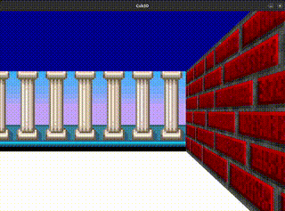

# cub3d

cub3d is a 3D game project built using the MinilibX library. It is a simple raycasting game inspired by Wolfenstein 3D.

## Gameplay video



## Requirements

### Linux
- gcc
- make
- X11 include files (package xorg)
- MiniLibx 

## Installation

1. Clone the repository:
    ```sh
    git clone https://github.com/yourusername/cub3d.git
    cd cub3d
    ```

2. Build the project:
    ```sh
    make
    ```

## Usage

To run the game, use the following command:
```sh
./cub3d maps/good/showcase.cubf